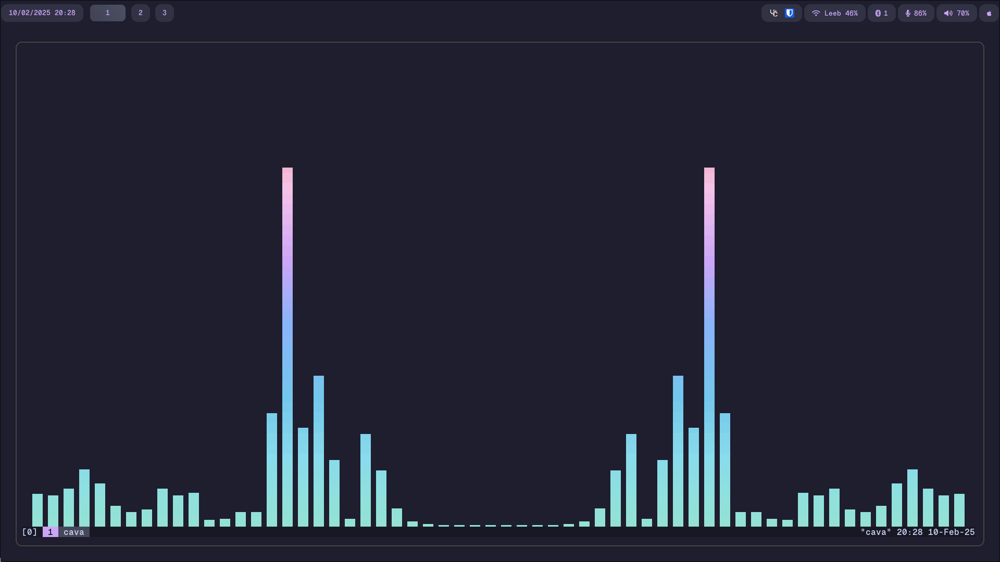

# My NixOS Flake

<div align="center">
    
    
</div>

<br />

This is my personal [NixOS](https://nixos.org/) configuration for my desktops and servers.

> [!IMPORTANT]
> I do not recommend anyone to use it since it is heavily personalised to my needs. However, the reason I share this repository is to simplify my deployments and allow others, especially new NixOS users, to explore different config structures to choose the best of all worlds.



## Synopsis

After restructuring my config over and over again, I came up with the following structure, which works very well for me at the moment:

```
.
├── docs
│   └── documentation-related files, e.g. screenshots, ...
├── homeModules
│   └── home-manager modules for user-specific configurations (browsers, editors, shells, etc.)
├── machines
│   ├── orion
│   │   ├── home
│   │   └── nixos
│   ├── pollux
│   │   ├── home
│   │   └── nixos
│   └── vega
│       ├── home
│       └── nixos
├── nixosModules
│   └── system-level NixOS modules (networking, hardware, security, etc.)
├── presets
│   ├── desktop
│   │   ├── home
│   │   └── nixos
│   ├── laptop
│   │   ├── home
│   │   └── nixos
│   ├── server
│   │   ├── home
│   │   └── nixos
│   └── shared
│       ├── home
│       └── nixos
├── scripts
│   └── useful scripts
├── secrets
│   └── sops secret files
├── wallpapers
│   └── wallpapers used by desktop hosts
```

## Usage

This NixOS configuration uses a flake-based approach with justfile commands for easy management:

```bash
# list all targets
just

# list available systems
just list

# build a specific system configuration
just build system

# switch to a specific system configuration
just switch system
```

## Features

- Multiple machine configurations (desktop, laptop, server)
- Hyprland desktop environment with Catppuccin theme
- Secret management via sops-nix
- Structured modular configuration 
- Home-Manager for user-level configurations

## Credits

This configuration takes advantage of some other repositories and projects, including:

- [home-manager](https://github.com/nix-community/home-manager)
- [sops-nix](https://github.com/Mic92/sops-nix)
- [hyprland](https://github.com/hyprwm/Hyprland)
- [catppuccin](https://github.com/catppuccin/nix)
- [wallpapers](./wallpapers/README.md)
- [Vimjoyer's Discord community](https://www.youtube.com/@vimjoyer)

